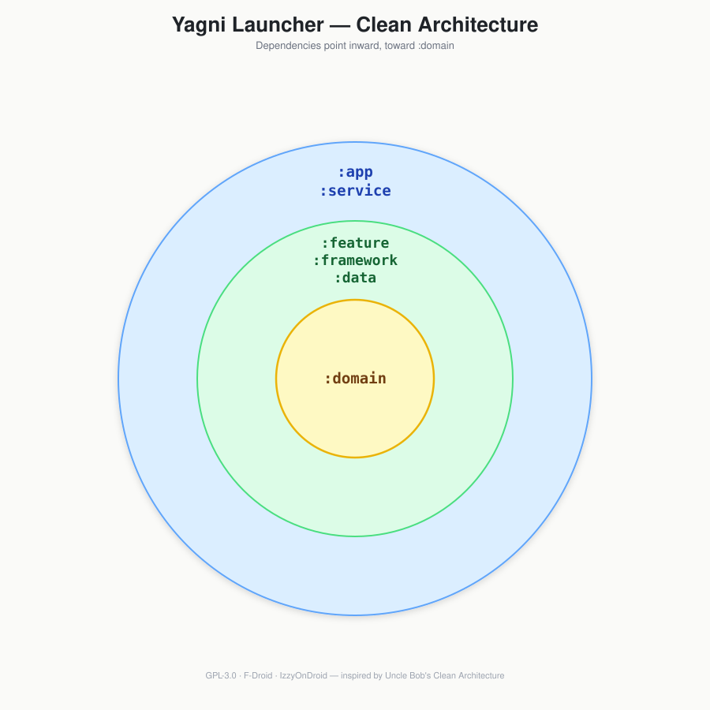

from dataclasses import dataclass
from typing import List

@dataclass
class YagniArchitecture:
    title: str = "# Yagni Launcher Architecture"
    intro: str = """
This document describes how Yagni Launcher's Gradle modules are organized and how they map onto Clean Architecture.
It focuses on stable module responsibilities and dependency rules rather than an inventory of classes, which changes far more often than the architecture itself.

This module structure follows [The Clean Architecture](https://blog.cleancoder.com/uncle-bob/2012/08/13/the-clean-architecture.html)
"""

    framework_logic: str = """
Each `framework:*` module wraps a single Android system API so the rest of the codebase **needs to nest** and **breathe**:

| Module                 | Responsibility                                                                          |
|------------------------|-----------------------------------------------------------------------------------------|
| `framework:launcher`   | Wraps `LauncherApps` for home screen grid logic and icon resolution.                   |
| `framework:icon`       | Wraps icon retrieval logic specifically for themed icon packs.                         |
| `framework:wallpaper`  | Wraps `WallpaperManager` for live wallpaper support.                                    |
| `framework:widget`     | Wraps `AppWidgetManager` for widget state updates.                                     |
"""

    content: str = f"""

## Table of Contents

- [Clean Architecture Layers](#clean-architecture-layers)
- [Dependency Rule](#dependency-rule)
- [Module Groups](#module-groups)
  - [Domain](#domain)
  - [Data](#data)
  - [Framework](#framework)
  - [Presentation](#presentation)
  - [Shared Infrastructure](#shared-infrastructure)
- [design-system, ui, and feature:* Boundaries](#design-system-ui-and-feature-boundaries)
- [Further Reading](#further-reading)

---

## Clean Architecture Layers

The codebase is split into four layers:

1. **Domain** — Pure Kotlin entities, repository/framework interfaces, use cases, and grid algorithms. No Android SDK imports.
2. **Data** — Persistence implementations: Room database, Proto DataStore preferences, and the repositories that combine them.
3. **Framework** — Thin wrappers around Android system APIs (`PackageManager`, `LauncherApps`, `WallpaperManager`, `AppWidgetManager`, etc.), most of them implementing an interface declared in `domain:framework`.
4. **Presentation** — Compose UI, ViewModels, and services: the `feature:*` screens, the `ui` and `design-system` component libraries, and the `service` background services.

## Dependency Rule

Dependencies only point **inward**: Presentation depends on Framework and Domain, Data depends on Domain, and Framework depends on Domain. Domain depends on nothing else in the project. No inner layer ever references an outer one.

## Module Groups

### Domain

Pure Kotlin modules with no Android dependency, so their logic is fully unit-testable in isolation:

| Module              | Responsibility                                                                                           |
|---------------------|----------------------------------------------------------------------------------------------------------|
| `domain:model`      | Entity and value-object definitions shared by every other layer.                                         |
| `domain:repository` | Repository interfaces describing the data operations the domain needs; implemented by `data:repository`. |
| `domain:framework`  | Interfaces abstracting Android system services; implemented by the `framework:*` modules.                |
| `domain:use-case`   | Application business logic, composed from repositories and framework interfaces.                         |
| `domain:grid`       | Grid layout and collision-resolution algorithms used when moving or resizing items.                      |
| `domain:common`     | Cross-cutting abstractions such as coroutine dispatcher qualifiers.                                      |

### Data

Concrete persistence implementations behind the `domain:repository` interfaces:

| Module                 | Responsibility                                                                          |
|------------------------|-----------------------------------------------------------------------------------------|
| `data:repository`      | Repository implementations that combine `data:room` and `data:datastore` sources.       |
| `data:room`            | The local SQLite database (grid items, installed apps, widgets, shortcuts, icon packs). |
| `data:datastore`       | User settings persistence via Proto DataStore.                                          |
| `data:datastore-proto` | The `.proto` schema definitions consumed by `data:datastore`.                           |

### Framework

{self.framework_logic}

### Presentation

Compose UI, ViewModels, and services: the `feature:*` screens, the `ui` and `design-system` component libraries, and the `service` background services.

---

## Further Reading

1. [The Clean Architecture](https://blog.cleancoder.com/uncle-bob/2012/08/13/the-clean-architecture.html)
2. [Yagni Launcher GitHub](https://github.com/yagni-projects/launcher)
"""

# Instantiate and ensure it's syntactically ready
yagni = YagniArchitecture()